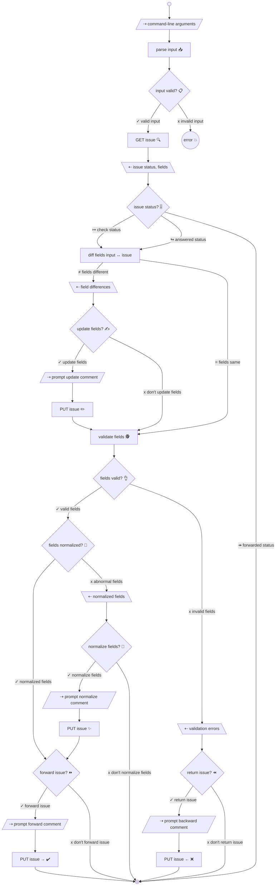

# issue-cli-mockup

```terminal
$ cargo run -- --field field3 value3-new --field field2 value2-new PRJ-1
? Comment for updated fields? › Changed fields `field2`, `field3`.
```


```mermaid
flowchart TD
    start@{ shape: sm-circ }
    input@{ shape: lean-r, label: "⇢ command-line arguments" }
    parse-input@{ shape: rect, label: "parse input 📥" }
    valid-input@{ shape: diamond, label: "input valid? 📋" }
    fetch@{ shape: rect, label: "GET issue 🔍" }
    output-issue@{ shape: lean-l, label: "⇠ issue status, fields" }
    status@{ shape: diamond, label: "issue status? 🎚️" }
    diff@{ shape: rect, label: "diff fields input ↔️ issue" }
    output-diff@{ shape: lean-l, label: "⇠ field differences" }
    update@{ shape: diamond, label: "update fields? ✍️" }
    prompt-update@{ shape: lean-r, label: "⇢ prompt update comment" }
    edit-fields@{ shape: rect, label: "PUT issue ✏️" }
    validate-fields@{ shape: rect, label: "validate fields 🕵️" }
    valid@{ shape: diamond, label: "fields valid? 👌" }
    normalized@{ shape: diamond, label: "fields normalized? 🟰" }
    transition-forward@{ shape: diamond, label: "forward issue? ⏩" }
    output-normalized@{ shape: lean-l, label: "⇠ normalized fields" }
    normalize@{ shape: diamond, label: "normalize fields? 🧼" }
    prompt-normalize@{ shape: lean-r, label: "⇢ prompt normalize comment" }
    edit-normalize@{ shape: rect, label: "PUT issue ✨" }
    output-validation@{ shape: lean-l, label: "⇠ validation errors" }
    transition-backward@{ shape: diamond, label: "return issue? ⏪" }
    prompt-forward@{ shape: lean-r, label: "⇢ prompt forward comment" }
    edit-forward@{ shape: rect, label: "PUT issue → ✔️" }
    prompt-backward@{ shape: lean-r, label: "⇢ prompt backward comment" }
    edit-backward@{ shape: rect, label: "PUT issue ← ❌" }
    stop@{ shape: framed-circle, label: "success 🎉" }
    error@{ shape: circle, label: "error 💥" }

    start --> input --> parse-input --> valid-input

    valid-input -- ✓ valid input --> fetch
    valid-input -- x invalid input --> error

    fetch --> output-issue --> status

    status -- ↦ check status --> diff
    status -- ↬ answered status --> diff
    status -- ↠ forwarded status --> stop

    diff -- ≠ fields different --> output-diff --> update
    diff -- = fields same --> validate-fields

    update -- ✓ update fields --> prompt-update --> edit-fields --> validate-fields
    update -- x don't update fields --> validate-fields

    validate-fields --> valid

    valid -- ✓ valid fields --> normalized
    valid -- x invalid fields --> output-validation --> transition-backward

    normalized -- ✓ normalized fields --> transition-forward
    normalized -- x abnormal fields --> output-normalized --> normalize

    normalize -- ✓ normalize fields --> prompt-normalize --> edit-normalize --> transition-forward
    normalize -- x don't normalize fields --> stop

    transition-backward -- ✓ return issue --> prompt-backward --> edit-backward --> stop
    transition-backward -- x don't return issue --> stop

    transition-forward -- ✓ forward issue --> prompt-forward --> edit-forward --> stop
    transition-forward -- x don't forward issue --> stop
```
