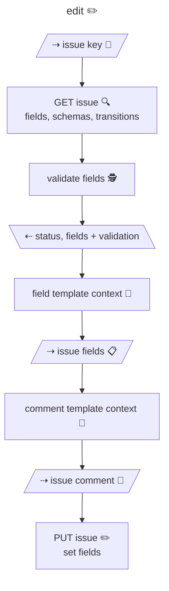
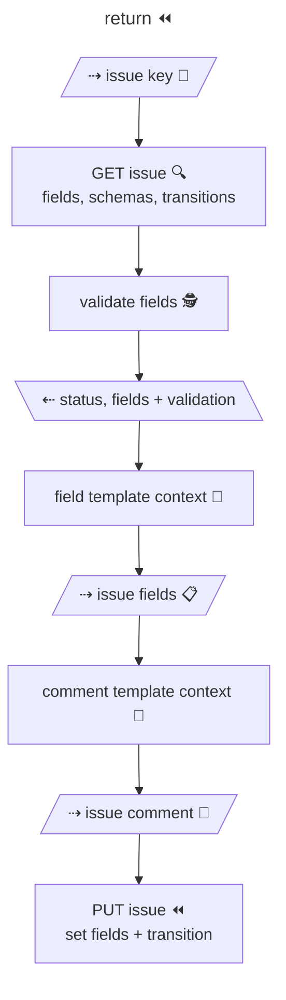
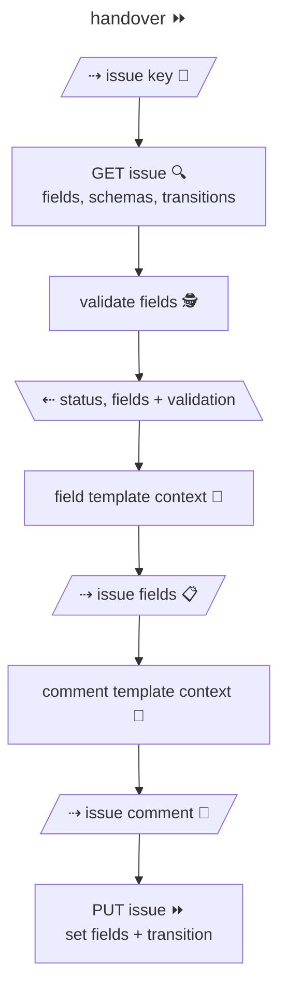

# issue-cli-mockup

```terminal
$ cargo run -- --field field3 value3-new --field field2 value2-new edit PRJ-42
? Comment for updated fields? › Changed fields `field2`, `field3`.
```


```mermaid
---
title: edit ✏️
---
flowchart TD
    input-key@{ shape: lean-r, label: "⇢ issue key 🪪" }
    get-issue@{ shape: rect, label: "GET issue 🔍\nfields, schemas, transitions" }
    validate@{ shape: rect, label: "validate fields 🕵️" }
    output-validation@{ shape: lean-l, label: "⇠ status, fields + validation" }
    field-template-context@{ shape: rect, label: "field template context 🧰" }
    input-fields@{ shape: lean-r, label: "⇢ issue fields 📋" }
    comment-template-context@{ shape: rect, label: "comment template context 🧰" }
    input-comment@{ shape: lean-r, label: "⇢ issue comment 💬" }
    put-issue@{ shape: rect, label: "PUT issue ✏️\nset fields" }

    input-key --> get-issue --> validate --> output-validation --> field-template-context --> input-fields --> comment-template-context --> input-comment --> put-issue
```


```mermaid
---
title: return ⏪
---
flowchart TD
    input-key@{ shape: lean-r, label: "⇢ issue key 🪪" }
    get-issue@{ shape: rect, label: "GET issue 🔍\nfields, schemas, transitions" }
    validate@{ shape: rect, label: "validate fields 🕵️" }
    output-validation@{ shape: lean-l, label: "⇠ status, fields + validation" }
    field-template-context@{ shape: rect, label: "field template context 🧰" }
    input-fields@{ shape: lean-r, label: "⇢ issue fields 📋" }
    comment-template-context@{ shape: rect, label: "comment template context 🧰" }
    input-comment@{ shape: lean-r, label: "⇢ issue comment 💬" }
    put-issue@{ shape: rect, label: "PUT issue ⏪\nset fields + transition" }

    input-key --> get-issue --> validate --> output-validation --> field-template-context --> input-fields --> comment-template-context --> input-comment --> put-issue
```


```mermaid
---
title: handover ⏩
---
flowchart TD
    input-key@{ shape: lean-r, label: "⇢ issue key 🪪" }
    get-issue@{ shape: rect, label: "GET issue 🔍\nfields, schemas, transitions" }
    validate@{ shape: rect, label: "validate fields 🕵️" }
    output-validation@{ shape: lean-l, label: "⇠ status, fields + validation" }
    field-template-context@{ shape: rect, label: "field template context 🧰" }
    input-fields@{ shape: lean-r, label: "⇢ issue fields 📋" }
    comment-template-context@{ shape: rect, label: "comment template context 🧰" }
    input-comment@{ shape: lean-r, label: "⇢ issue comment 💬" }
    put-issue@{ shape: rect, label: "PUT issue ⏩\nset fields + transition" }

    input-key --> get-issue --> validate --> output-validation --> field-template-context --> input-fields --> comment-template-context --> input-comment --> put-issue
```
